---
## Author
author:
  name: Мурашов Иван Вячеславович
  email: 1132236018@rudn.ru
  affiliation:
    - name: Российский университет дружбы народов
      country: Российская Федерация
      postal-code: 117198
      city: Москва
      address: ул. Миклухо-Маклая, д. 6
## Title
title: Лабораторная работа №2
subtitle: Имитационное моделирование
license: CC BY
date: 2026-03-02
date-format: "YYYY-MM-DD"
---

## Цель работы

Цель данной работы — изучить основные модели SIR и Лотки–Вольтерры, а так же изучить аспекты их программной реализации.

## Подготовка рабочего пространства

В этом разделе мы будем использовать уже известные нам скрипты из 1ой лабораторной работы.

Создадим каталог проекта DrWatson с помощью скрипта setup_project.jl ([рис. @fig-001]).

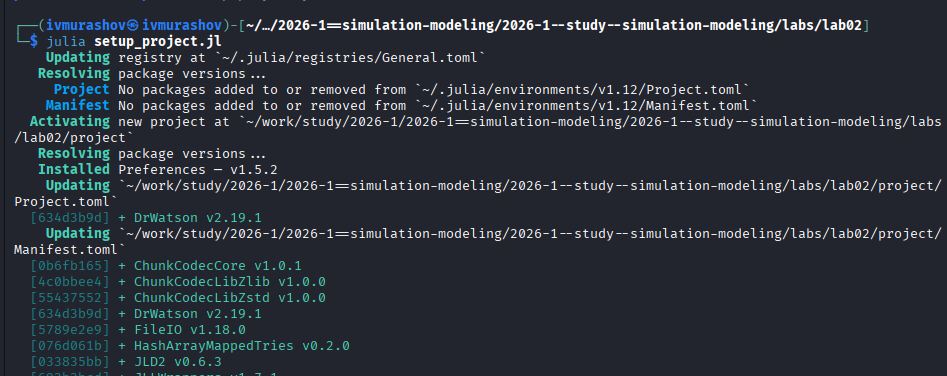{#fig-001 width=70%}

## Подготовка рабочего пространства

Добавим необходимые пакеты с помощью скрипта add_packages.jl ([рис. @fig-002]).

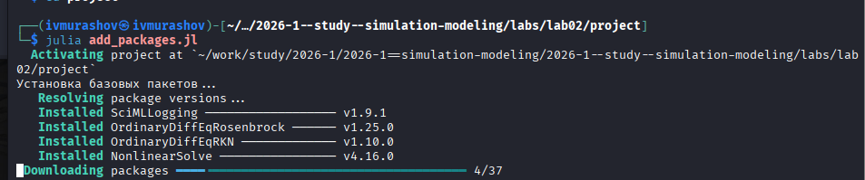{#fig-002 width=70%}

## Подготовка рабочего пространства

Проверим корректность установки с помощью скрипта scripts/test_setup.jl ([рис. @fig-003]).

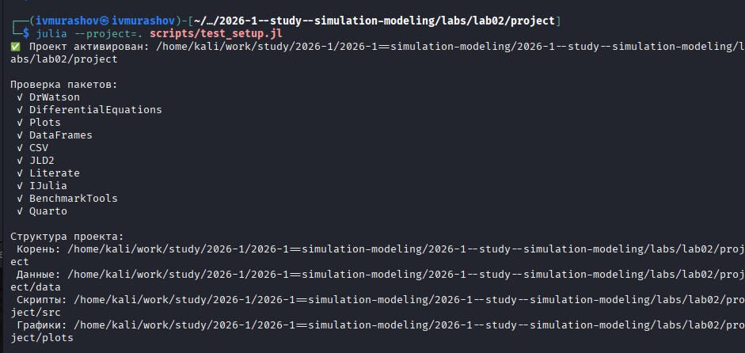{#fig-003 width=70%}

## Модель SIR

Создаём файл scripts/sir_ode.jl с реализацией модели ([рис. @fig-004]).

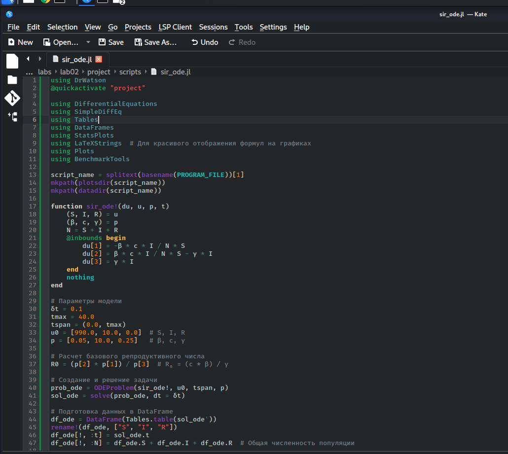{#fig-004 width=70%}

## Модель SIR

Создадим производные форматы ([рис. @fig-005]).

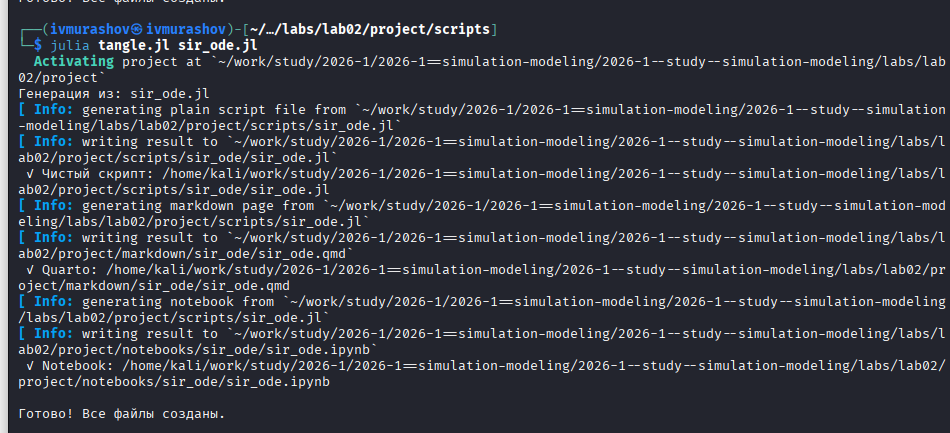{#fig-005 width=70%}

## Модель SIR

Просмотрим каталог с графиками ([рис. @fig-006]).

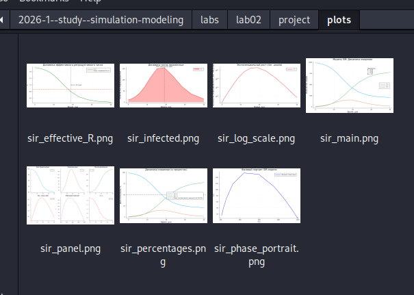{#fig-006 width=70%}

## Модель SIR

Просмотрим qmd файл ([рис. @fig-007]).

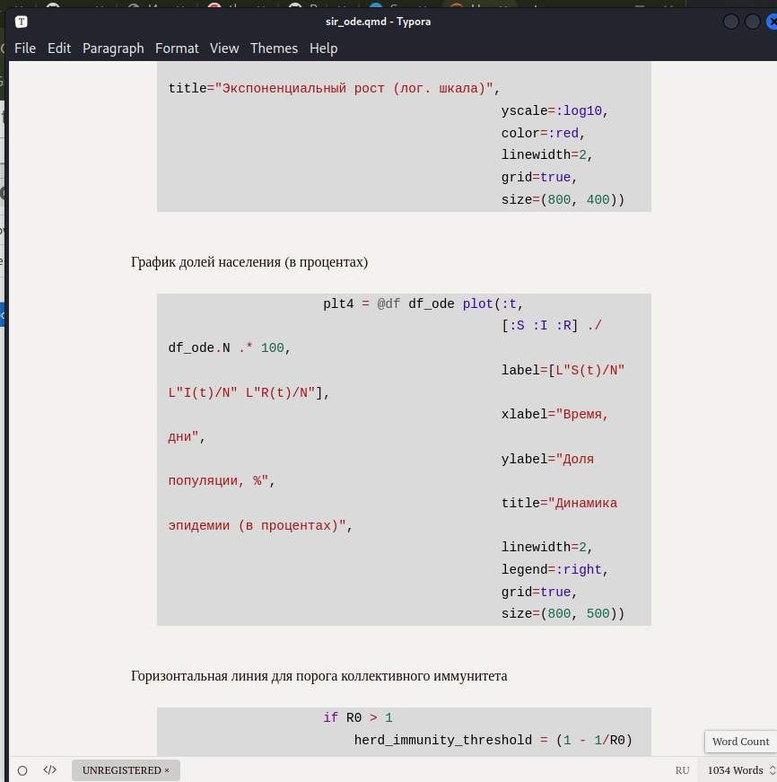{#fig-007 width=70%}

## Модель SIR

Просмотрим jupyter-notebook и запустим все ячейки ([рис. @fig-008]).

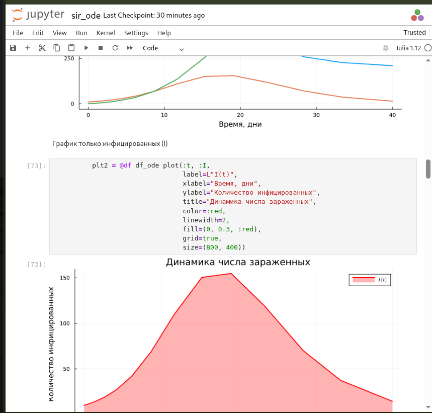{#fig-008 width=70%}

## Модель Лотки–Вольтерры

Создаём файл scripts/lv_ode.jl с реализацией модели ([рис. @fig-009]).

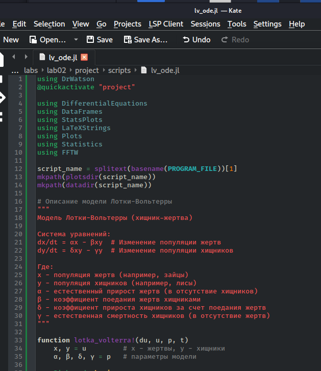{#fig-009 width=70%}

## Модель Лотки–Вольтерры

Создадим производные форматы ([рис. @fig-010]).

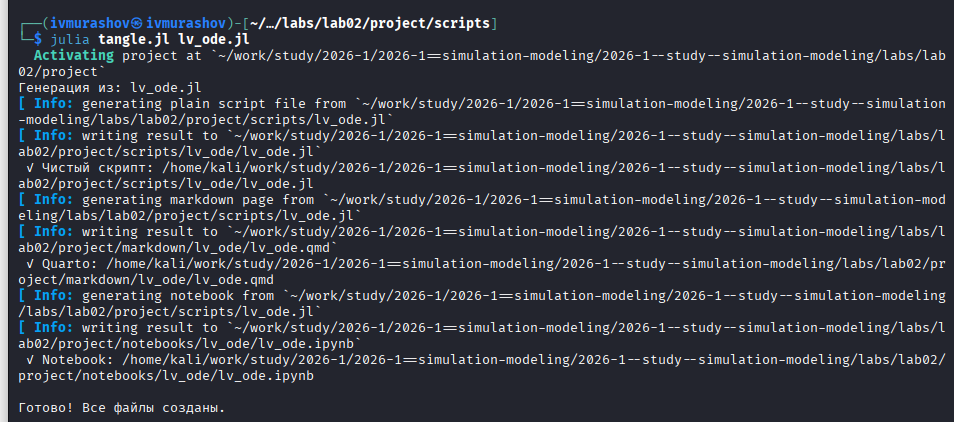{#fig-010 width=70%}

## Модель Лотки–Вольтерры

Просмотрим каталог с графиками ([рис. @fig-011]).

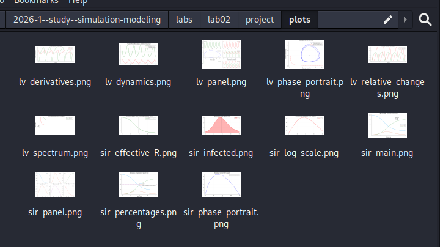{#fig-011 width=70%}

## Модель Лотки–Вольтерры

Просмотрим qmd файл ([рис. @fig-012]).

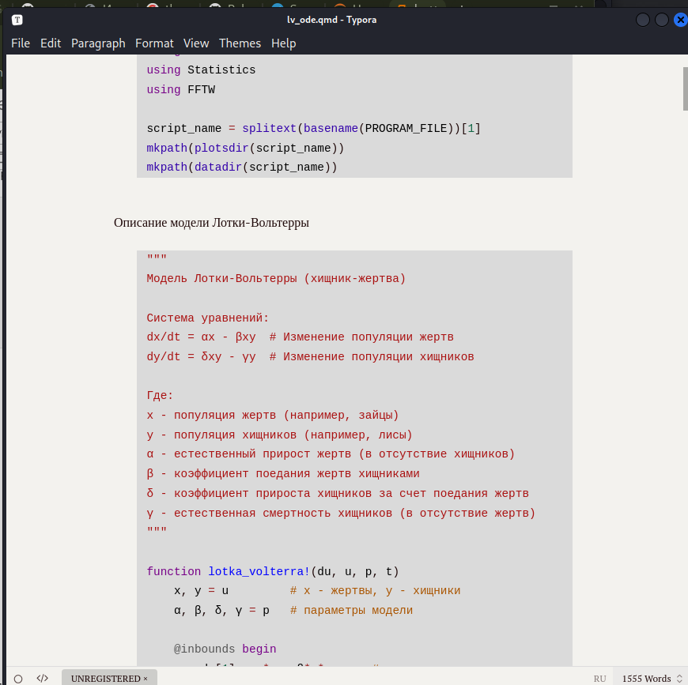{#fig-012 width=70%}

## Модель Лотки–Вольтерры

Просмотрим jupyter-notebook и запустим все ячейки ([рис. @fig-013]).

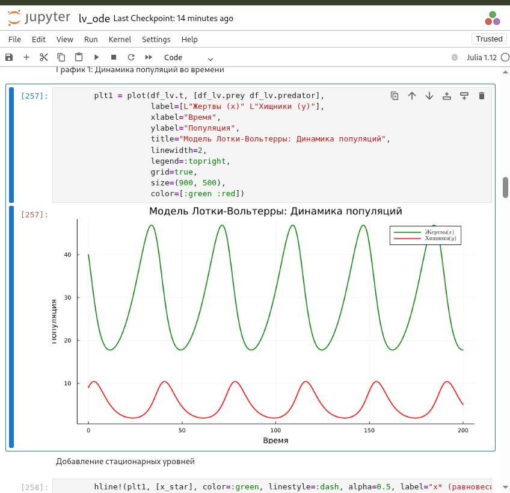{#fig-013 width=70%}

## Модель Лотки–Вольтерры

В файле отчёта после описания выполнения лабораторной работы подключим файл описания программы ([рис. @fig-014]).

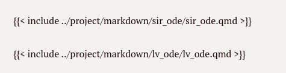{#fig-014 width=70%}

## Модель Лотки–Вольтерры

Просмотрим результат ([рис. @fig-015]).

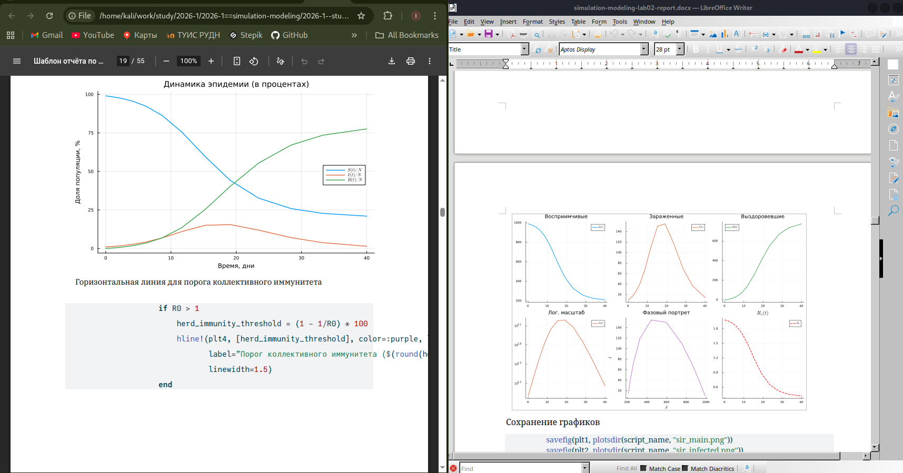{#fig-015 width=70%}

## Выводы

В ходе данной лабораторной работы мной были изучены основные модели SIR и Лотки–Вольтерры, а так же аспекты их программной реализации.
