---
## Author
author:
  name: Мурашов Иван Вячеславович
  email: 1132236018@rudn.ru
  affiliation:
    - name: Российский университет дружбы народов
      country: Российская Федерация
      postal-code: 117198
      city: Москва
      address: ул. Миклухо-Маклая, д. 6
## Title
title: Лабораторная работа №3
subtitle: Имитационное моделирование
license: CC BY
date: 2026-03-14
date-format: "YYYY-MM-DD"
---

## Цель работы

Целью данной лабораторной работы является ознакомление с моделью DaisyWorld и визуальная реализация модели с маргаритками с помощью Agents.jl.

## Реализация на Agents.jl

Создадим файл src/daisyworld.jl. Здесь мы определим тип агента и функции шага модели ([рис. @fig-001]).

{#fig-001 width=70%}

## Базовая визуализация

Сделаем базовую визуализацию. Построим тепловую карту, которая будет представлять собой температуру поверхности модели. Маргаритки будут отображаться черно-белыми в соответствии с их видом ([рис. @fig-002]).

{#fig-002 width=70%}

## Базовая визуализация

Запустим скрипт ([рис. @fig-003]).

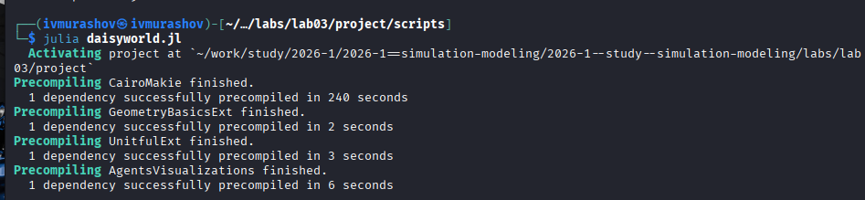{#fig-003 width=70%}

## Базовая визуализация

Просмотрим результирующие изображения в каталоге plots:

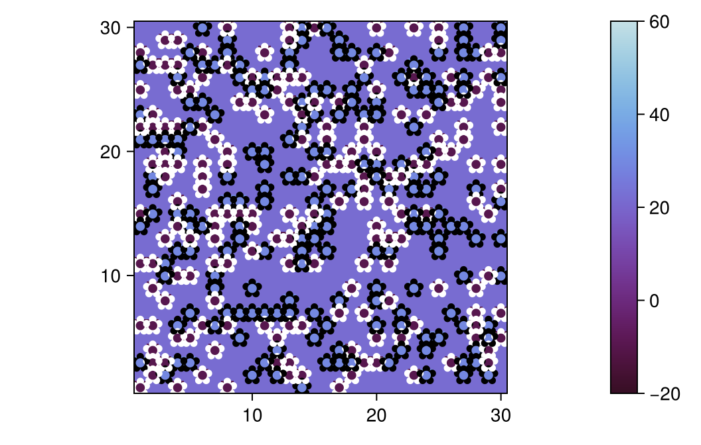{width=70%}

## Базовая визуализация

{width=70%}

## Базовая визуализация

{width=70%}

## Базовая визуализация

Создадим производные форматы с помощью скрипта tangle.jl ([рис. @fig-005]).

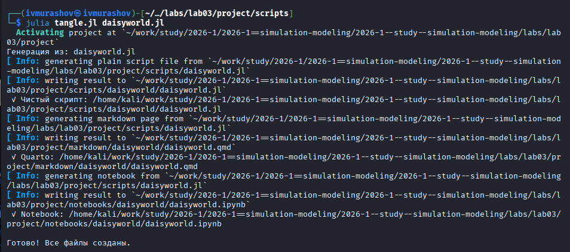{#fig-005 width=70%}

## Базовая визуализация

Запустим файл ipynb в jupyter-notebook ([рис. @fig-006]).

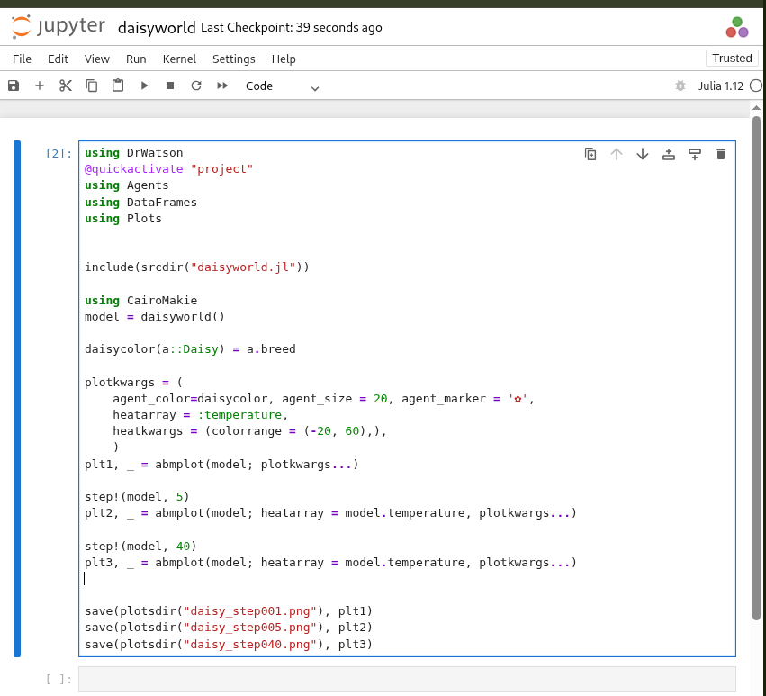{#fig-006 width=70%}

## Анимация модели

Создадим визуализацию не отдельных моментов, а видео эволюции модели ([рис. @fig-007]).

{#fig-007 width=70%}

## Анимация модели

Запустим скрипт ([рис. @fig-008]).

{#fig-008 width=70%}

## Анимация модели

Далее я решил замедлить видео и создал simulation2. Просмотрим результирующие видео ([рис. @fig-009]).

{#fig-009 width=70%}

## Анимация модели

А вы можете их просмотреть здесь:

[simulation.mp4](https://rutube.ru/video/d97cc64007b2ad6d65fc7f5ffde4e432/)

[simulation2.mp4](https://rutube.ru/video/e1690ec27d37f3315a1f770cd907abdf/)

## Динамика числа маргариток

Построим график изменения числа маргариток в зависимости от модельного времени ([рис. @fig-010]).

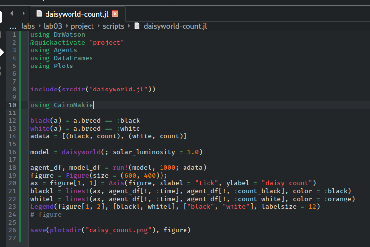{#fig-010 width=70%}

## Динамика числа маргариток

Запустим скрипт ([рис. @fig-011]).

{#fig-011 width=70%}

## Динамика числа маргариток

Создадим производные форматы с помощью скрипта tangle.jl ([рис. @fig-012]).

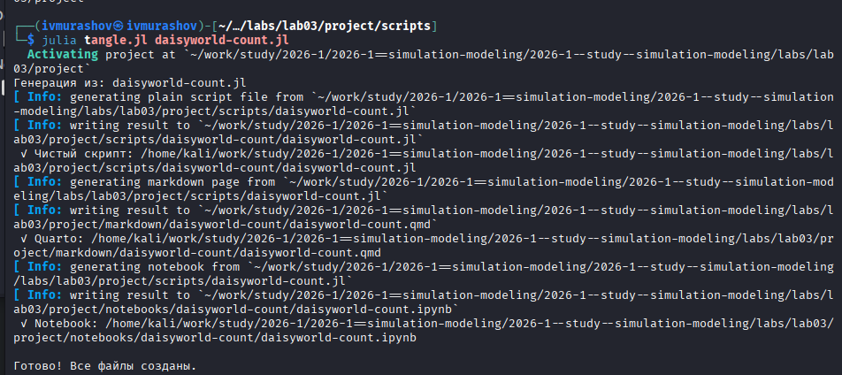{#fig-012 width=70%}

## Динамика числа маргариток

Запустим файл ipynb в jupyter-notebook ([рис. @fig-013]).

{#fig-013 width=70%}

## Динамика числа маргариток

Просмотрим результирующие изображения в каталоге plots:

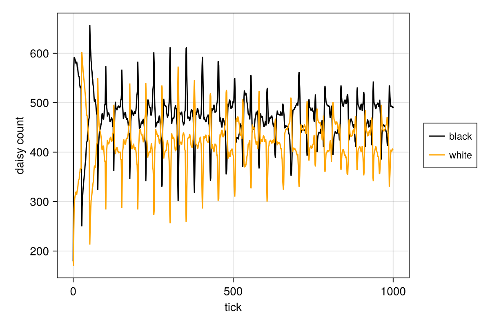{width=70%}

## Динамика модели

Построим комплексный график изменения числа маргариток, температуры, альбедо в зависимости от модельного времени ([рис. @fig-014]).

{#fig-014 width=70%}

## Динамика модели

Запустим скрипт ([рис. @fig-015]).

{#fig-015 width=70%}

## Динамика модели

Создадим производные форматы с помощью скрипта tangle.jl ([рис. @fig-016]).

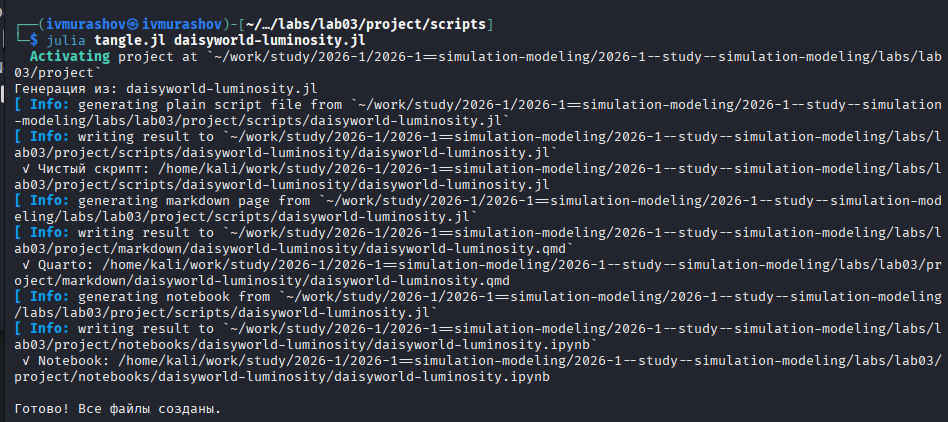{#fig-016 width=70%}

## Динамика модели

Запустим файл ipynb в jupyter-notebook ([рис. @fig-017]).

{#fig-017 width=70%}

## Динамика модели

Просмотрим результирующие изображения в каталоге plots:

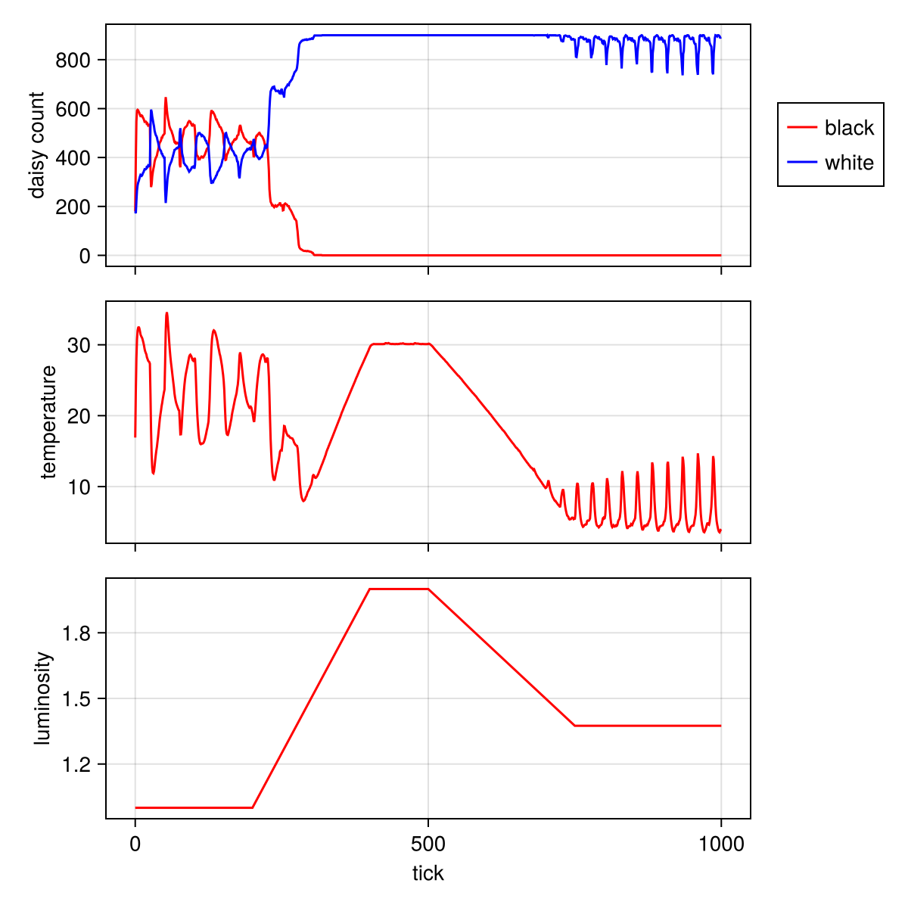{width=70%}

## Базовая визуализация (параметры)

Расширим базовую визуализацию за счёт параметров ([рис. @fig-018]).

{#fig-018 width=70%}

## Базовая визуализация (параметры)

Запустим скрипт ([рис. @fig-019]).

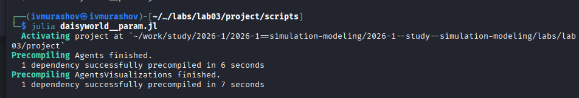{#fig-019 width=70%}

## Базовая визуализация (параметры)

Просмотрим результирующие изображения в каталоге plots ([рис. @fig-020]).

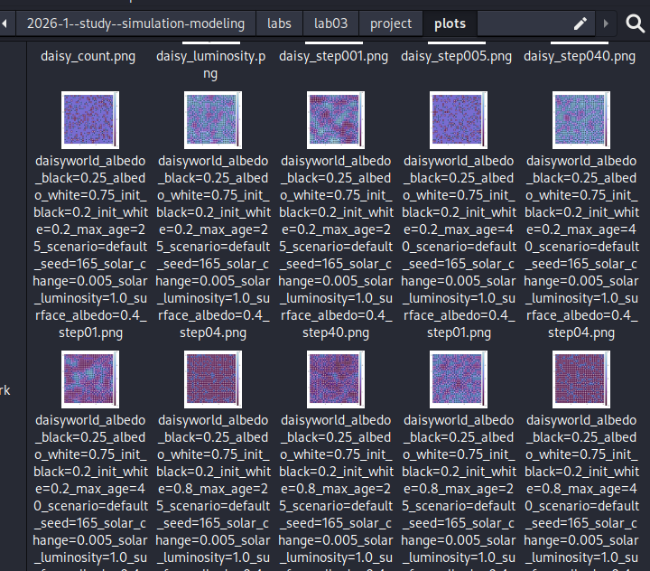{#fig-020 width=70%}

## Базовая визуализация (параметры)

Создадим производные форматы с помощью скрипта tangle.jl ([рис. @fig-021]).

{#fig-021 width=70%}

## Базовая визуализация (параметры)

Запустим файл ipynb в jupyter-notebook ([рис. @fig-022]).

{#fig-022 width=70%}

## Динамика модели (параметры)

Построим график изменения числа маргариток в зависимости от модельного времени с разными параметрами модели ([рис. @fig-023]).

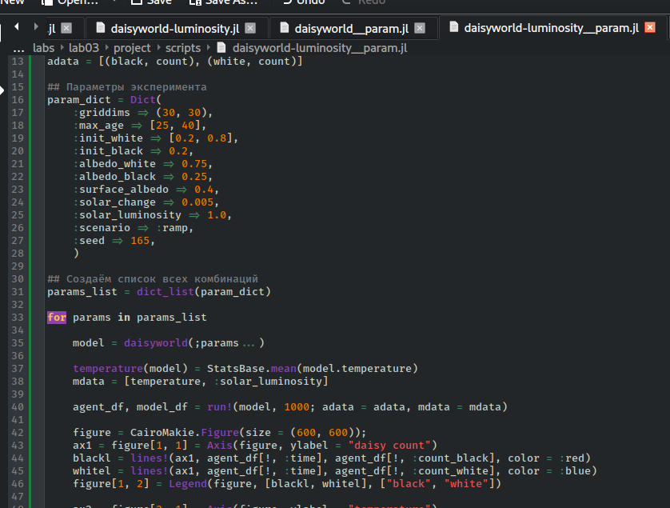{#fig-023 width=70%}

## Динамика модели (параметры)

Запустим скрипт ([рис. @fig-024]).

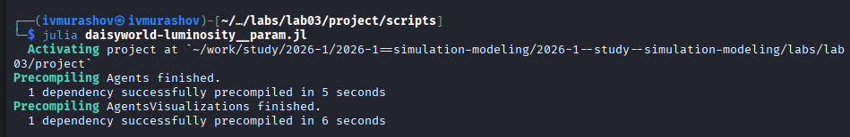{#fig-024 width=70%}

## Динамика модели (параметры)

Просмотрим результирующие изображения в каталоге plots ([рис. @fig-025]).

{#fig-025 width=70%}

## Динамика модели (параметры)

Создадим производные форматы с помощью скрипта tangle.jl ([рис. @fig-026]).

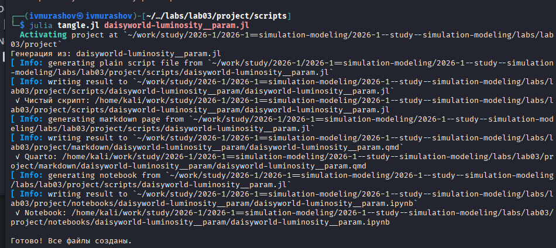{#fig-026 width=70%}

## Динамика модели (параметры)

Запустим файл ipynb в jupyter-notebook ([рис. @fig-027]).

{#fig-027 width=70%}

## Выводы

В ходе данной лабораторной работы мной была изучена модель DaisyWorld и визуально реализованы модели с маргаритками с помощью Agents.jl.
