---
## Author
author:
  name: Мурашов Иван Вячеславович
  email: 1132236018@rudn.ru
  affiliation:
    - name: Российский университет дружбы народов
      country: Российская Федерация
      postal-code: 117198
      city: Москва
      address: ул. Миклухо-Маклая, д. 6
## Title
title: Лабораторная работа №4
subtitle: Имитационное моделирование
license: CC BY
date: 2026-03-30
date-format: "YYYY-MM-DD"
---

## Цель работы

Цель данной лабораторной работы — cравнить детерминированный (модель SIR на ОДУ) и стохастический (агентный) подходы к моделированию эпидемий, оценив преимущества агентного моделирования в учёте пространственной структуры и индивидуальных характеристик агентов.

# Выполнение лабораторной работы

Предварительно проверим правильность структуры нашего проекта ([рис. @fig-001]).

{#fig-001 width=70%}

## Код модели

Создадим файл src/sir_model.jl с описанием базовой модели SIR ([рис. @fig-002]).

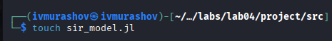{#fig-002 width=70%}

## Базовый эксперимент

Создадим файл src/sir_run_basic.jl. Код в нём запускает один эксперимент с фиксированными параметрами (по умолчанию) и сохраняет динамику численности агентов. Это служит для проверки работоспособности модели и получения базового понимания эпидемического процесса  ([рис. @fig-003]).

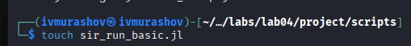{#fig-003 width=70%}

## Базовый эксперимент

Запустим скрипт ([рис. @fig-004]).

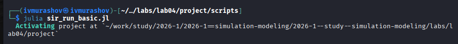{#fig-004 width=70%}

## Базовый эксперимент

Создадим производные форматы с помощью скрипта tangle.jl ([рис. @fig-005]).

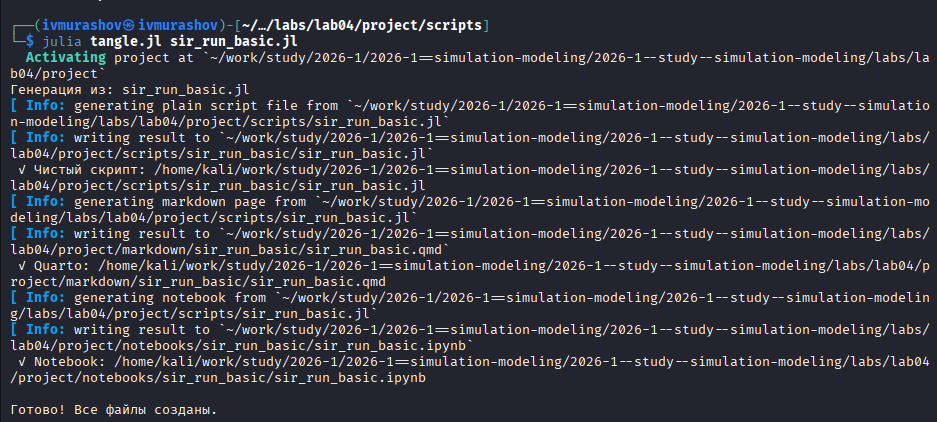{#fig-005 width=70%}

## Базовый эксперимент

Запустим файл ipynb в jupyter-notebook ([рис. @fig-006]).

{#fig-006 width=70%}

## Базовый эксперимент

Просмотрим результирующие графики.

{ width=70%}

## Сканирование коэффициента заразности

Создадим файл src/sir_scan_beta.jl. Код в нём исследует, как изменение базовой заразности (β_und и пропорционально β_det) влияет на эпидемические показатели: пик заболеваемости, долю переболевших, число умерших. Выполняется параметрическое сканирование с несколькими повторными прогонами для учёта стохастичности ([рис. @fig-007]).

{#fig-007 width=70%}

## Сканирование коэффициента заразности

Запустим скрипт ([рис. @fig-008]).

{#fig-008 width=70%}

## Сканирование коэффициента заразности

Просмотрим результирующую таблицу csv ([рис. @fig-009]).

{#fig-009 width=70%}

## Сканирование коэффициента заразности

Создадим производные форматы с помощью скрипта tangle.jl ([рис. @fig-010]).

{#fig-010 width=70%}

## Сканирование коэффициента заразности

Запустим файл ipynb в jupyter-notebook ([рис. @fig-011]).

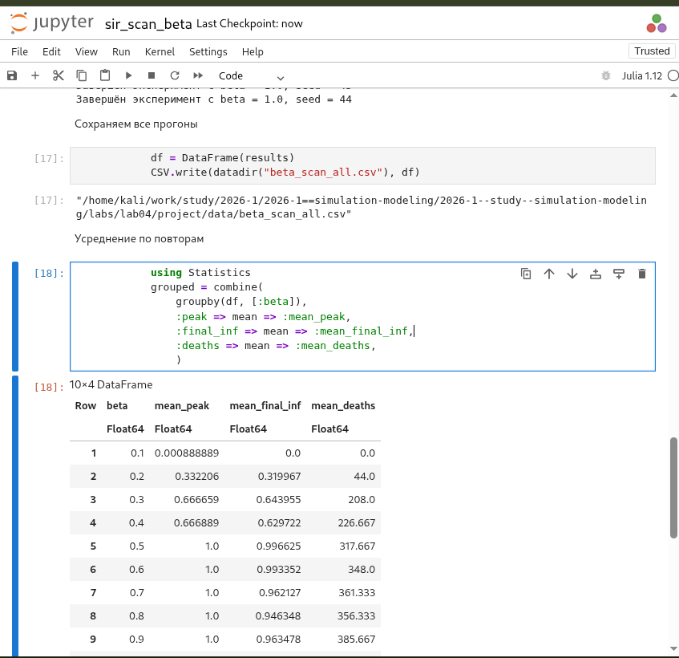{#fig-011 width=70%}

## Исследование эффекта миграции

Создадим файл src/sir_migration_effect.jl. Код в нём исследует исследует, как интенсивность перемещения людей между городами влияет на скорость распространения эпидемии (время достижения пика) и масштаб пика. Инфекция начинается только в одном городе, остальные изначально здоровы ([рис. @fig-012]).

{#fig-012 width=70%}

## Исследование эффекта миграции

Запустим скрипт ([рис. @fig-013]).

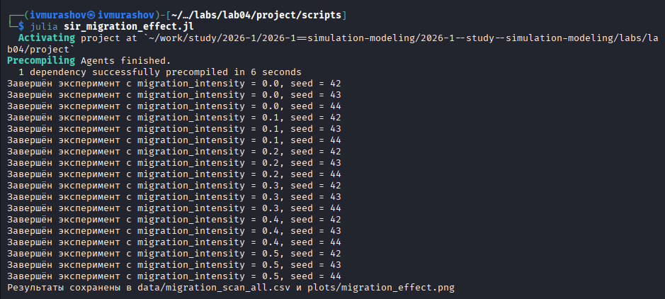{#fig-013 width=70%}

## Исследование эффекта миграции

Просмотрим результирующую таблицу csv ([рис. @fig-014]).

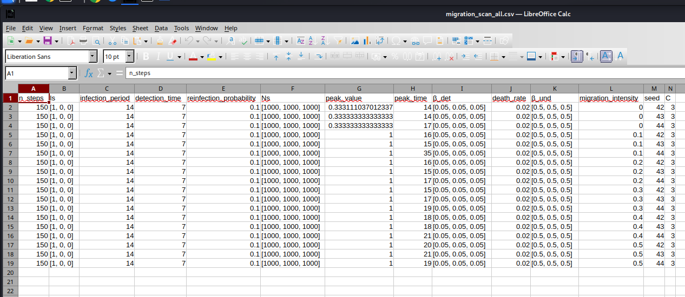{#fig-014 width=70%}

## Исследование эффекта миграции

Создадим производные форматы с помощью скрипта tangle.jl ([рис. @fig-015]).

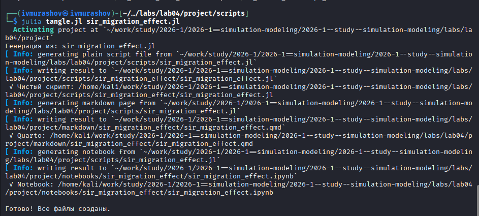{#fig-015 width=70%}

## Исследование эффекта миграции

Запустим файл ipynb в jupyter-notebook ([рис. @fig-016]).

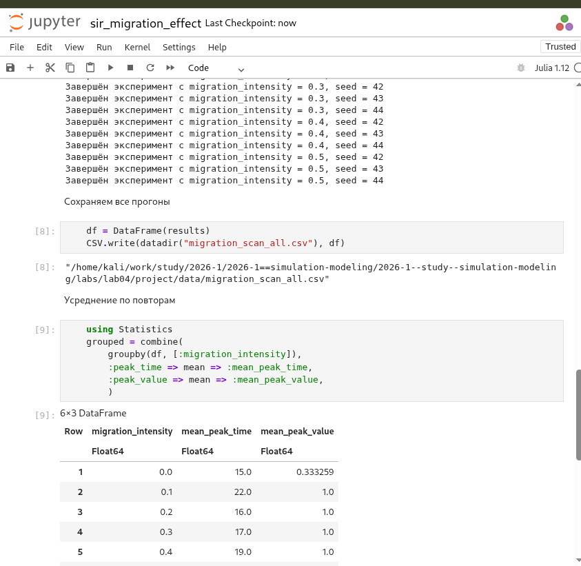{#fig-016 width=70%}

## Исследование эффекта миграции

Просмотрим результирующие графики.

{ width=70%}

## Многокритериальная оптимизация параметров

Создадим файл src/sir_optimize_parameters.jl. Код в нём ищет оптимальные комбинации параметров, минимизирующие одновременно два критерия: пиковую заболеваемость и долю умерших. Использует эволюционный алгоритм (Borg MOEA) из пакета BlackBoxOptim ([рис. @fig-017]).

{#fig-017 width=70%}

## Многокритериальная оптимизация параметров

Запустим скрипт ([рис. @fig-018]).

{#fig-018 width=70%}

## Многокритериальная оптимизация параметров

Создадим производные форматы с помощью скрипта tangle.jl ([рис. @fig-019]).

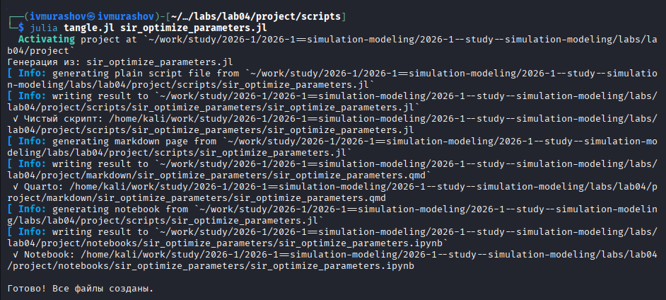{#fig-019 width=70%}

## Многокритериальная оптимизация параметров

Запустим файл ipynb в jupyter-notebook ([рис. @fig-020]).

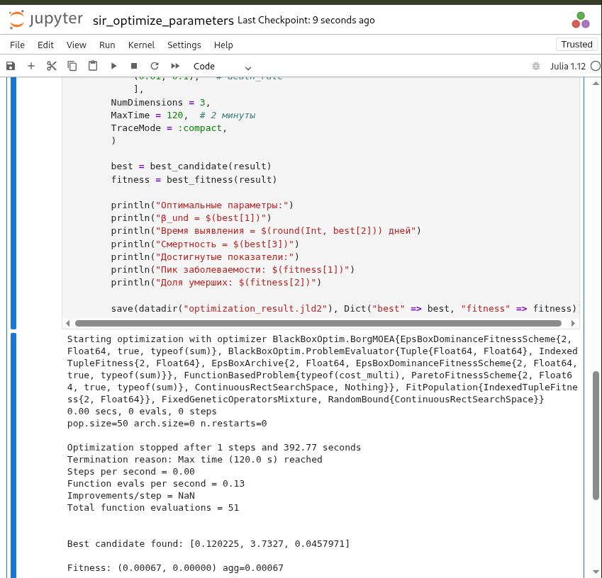{#fig-020 width=70%}

## Сводная визуализация результатов

Создадим файл src/sir_visualize_dynamics.jl ([рис. @fig-021]). Этот скрипт загружает результаты параметрического сканирования (файл data/beta_scan_all.csv, созданный scan_beta.jl) и строит единый составной график, объединяющий три панели:

 пик эпидемии и конечная доля инфицированных;
 
 число умерших;
 
 доля выздоровевших. 

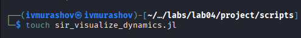{#fig-021 width=70%}

## Сводная визуализация результатов

Запустим скрипт ([рис. @fig-022]).

{#fig-022 width=70%}

## Сводная визуализация результатов

Создадим производные форматы с помощью скрипта tangle.jl ([рис. @fig-023]).

{#fig-023 width=70%}

## Сводная визуализация результатов

Запустим файл ipynb в jupyter-notebook ([рис. @fig-024]).

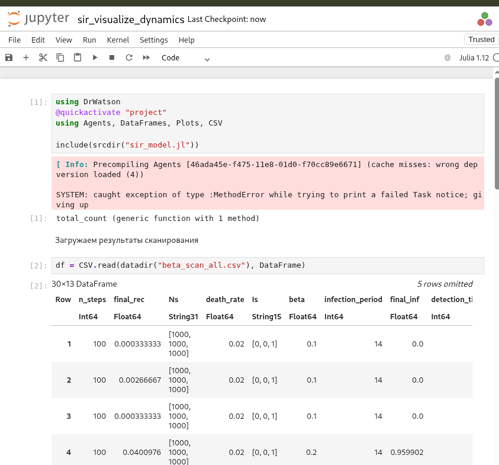{#fig-024 width=70%}

## Сводная визуализация результатов

Просмотрим результирующие графики.

{ width=70%}

## Выводы

В ходе данной лабораторной работы мной были изучены  детерминированный (модель SIR на ОДУ) и стохастический (агентный) подходы к моделированию эпидемий, оценены преимущества агентного моделирования в учёте пространственной структуры и индивидуальных характеристик агентов.

