---
## Author
author:
  name: Мурашов Иван Вячеславович
  email: 1132236018@rudn.ru
  affiliation:
    - name: Российский университет дружбы народов
      country: Российская Федерация
      postal-code: 117198
      city: Москва
      address: ул. Миклухо-Маклая, д. 6
## Title
title: Лабораторная работа №5
subtitle: Имитационное моделирование
license: CC BY
date: 2026-04-18
date-format: "YYYY-MM-DD"
---

## Цель работы

Цели данной лабораторной работы:

Построить сеть Петри для пяти философов, моделируя захват и освобождение вилок.
Обнаружить состояние взаимной блокировки (deadlock), когда каждый философ взял одну вилку и ждёт вторую.
Провести имитационное моделирование (стохастическое и детерминированное) и выявить наличие deadlock.
Модифицировать сеть, чтобы предотвратить deadlock.
Проанализировать результаты и оформить отчёт с графиками и анимацией.

# Выполнение лабораторной работы

Предварительно проверим правильность структуры нашего проекта ([рис. @fig-001]).

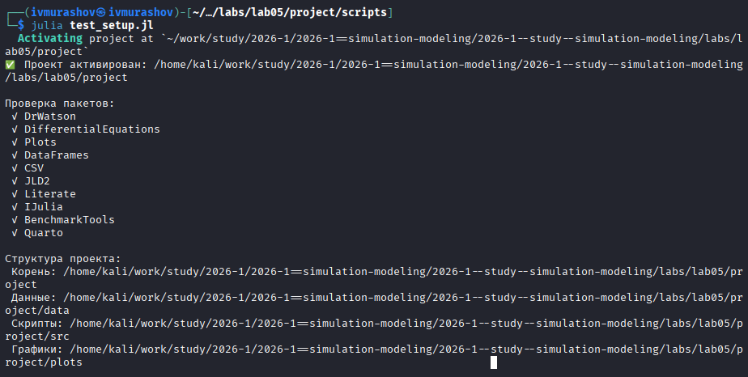{#fig-001 width=70%}

## Код модели

Создадим файл src/DiningPhilosophers.jl с описанием базовой модели сети Петри ([рис. @fig-002]).

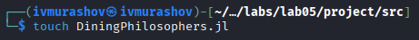{#fig-002 width=70%}

## Базовые эксперименты

Создадим файл scripts/dining_philosophers.jl. Скрипт выполняет основное моделирование и сравнение двух вариантов сети Петри: классическую модель (без арбитра), в которой возможна взаимная блокировка (deadlock) и модифицированную модель с арбитром, которая должна предотвращать deadlock ([рис. @fig-003]).

{#fig-003 width=70%}

## Базовые эксперименты

Запустим скрипт ([рис. @fig-004]).

{#fig-004 width=70%}

## Базовые эксперименты

Создадим производные форматы с помощью скрипта tangle.jl ([рис. @fig-005]).

{#fig-005 width=70%}

## Базовые эксперименты

Запустим файл ipynb в jupyter-notebook ([рис. @fig-006]).

{#fig-006 width=70%}

## Базовые эксперименты

Просмотрим результирующие графики.

{ width=70%}

## Базовые эксперименты

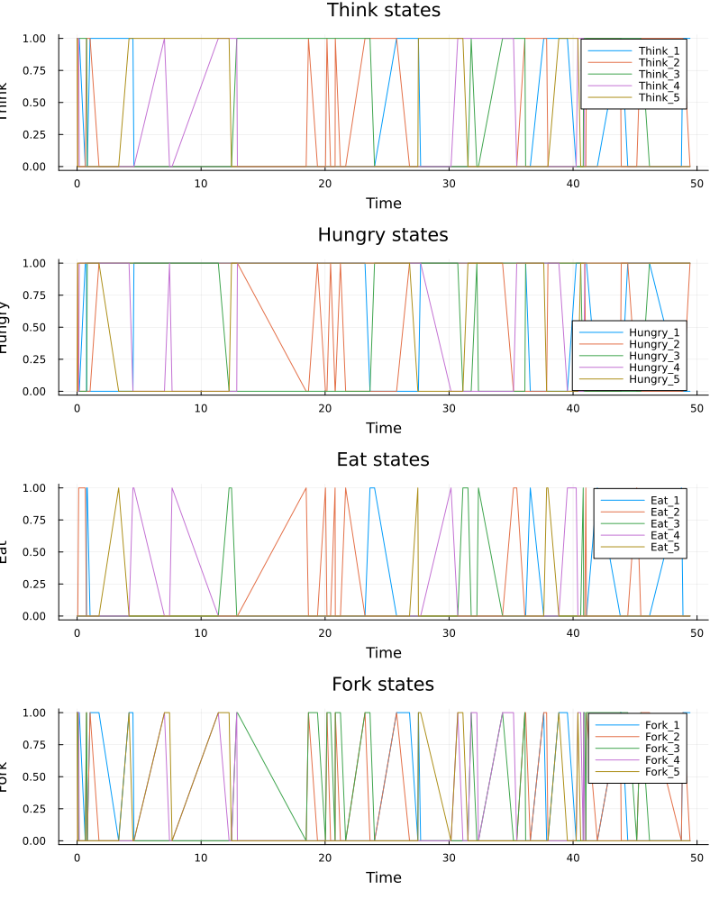{ width=70%}

## Анимация процесса

Создадим файл scripts/dining_philosophers_animation.jl. Анимация позволяет увидеть, как меняется маркировка (фишки) в каждой позиции, и особенно наглядно показывает возникновение deadlock в классической модели ([рис. @fig-007]).

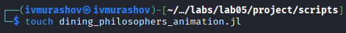{#fig-007 width=70%}

## Анимация процесса

Запустим скрипт ([рис. @fig-008]).

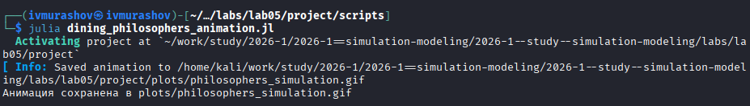{#fig-008 width=70%}

## Анимация процесса

Создадим производные форматы с помощью скрипта tangle.jl ([рис. @fig-009]).

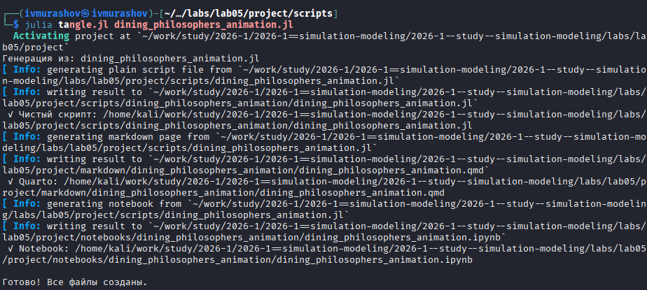{#fig-009 width=70%}

## Анимация процесса

Запустим файл ipynb в jupyter-notebook ([рис. @fig-010]).

{#fig-010 width=70%}

Просмотрим результирующий gif-файл.

## Итоговый отчёт

Создадим файл scripts/dining_philosophers_report.jl. Он нужен для сравнительного анализа двух моделей (с арбитром и без) по одному ключевому показателю — числу философов, находящихся в состоянии «Ест» (Eat_i). Скрипт генерирует сводный график ([рис. @fig-011]).

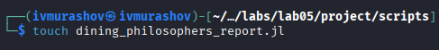{#fig-011 width=70%}

## Итоговый отчёт

Запустим скрипт ([рис. @fig-012]).

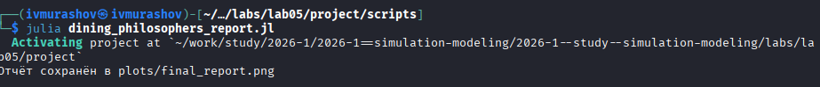{#fig-012 width=70%}

## Итоговый отчёт

Создадим производные форматы с помощью скрипта tangle.jl ([рис. @fig-013]).

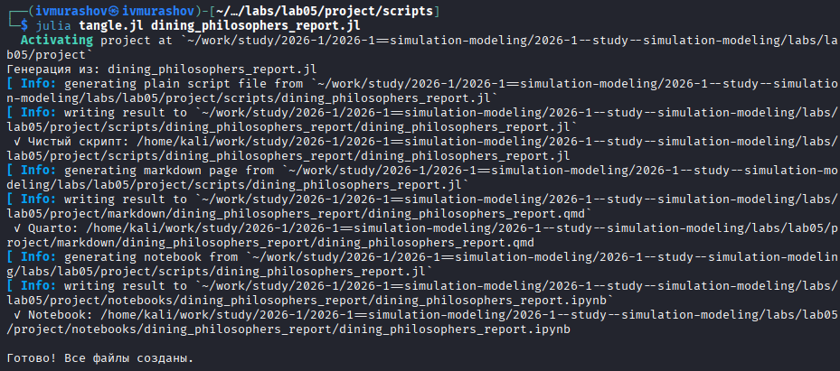{#fig-013 width=70%}

## Итоговый отчёт

Запустим файл ipynb в jupyter-notebook ([рис. @fig-014]).

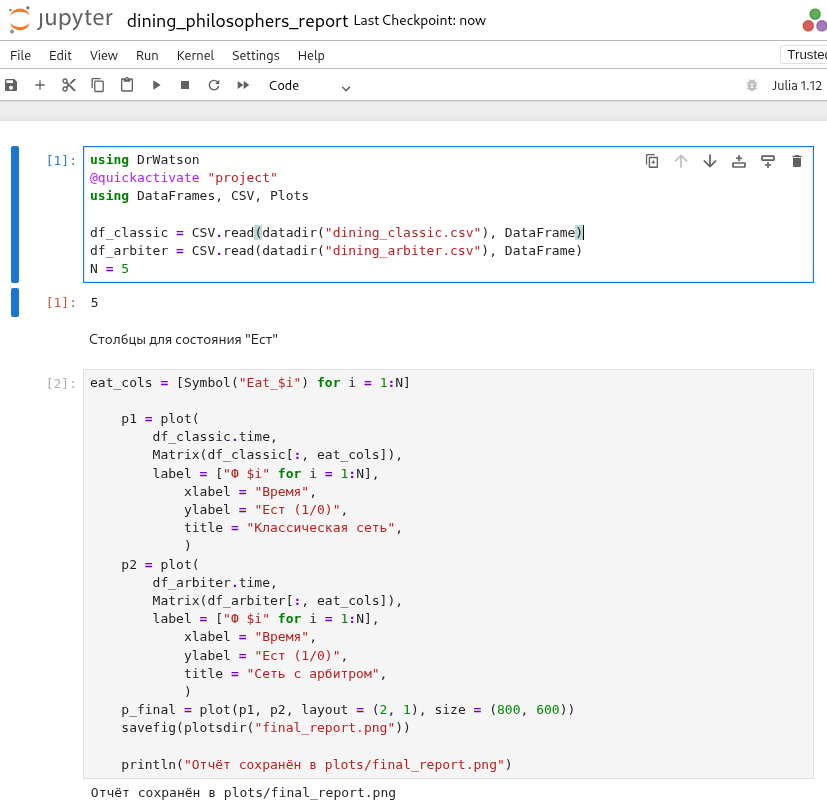{#fig-014 width=70%}

## Итоговый отчёт

Просмотрим результирующие графики.

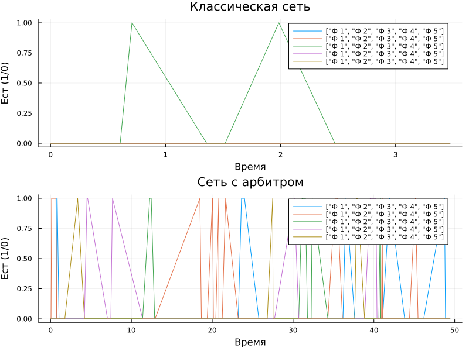{ width=70%}

## Выводы

В ходе данной лабораторной работы мной были построены классическая и модифицированная сети Петри для задачи "Обедающие философы", проведено стохастическое и детерминированное имитационное моделирование, обнаружен deadlock в классической сети и продемонстрировано его предотвращение с помощью арбитра, а также выполнен анализ результатов с визуализацией в виде графиков и анимации.
