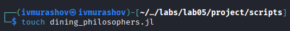
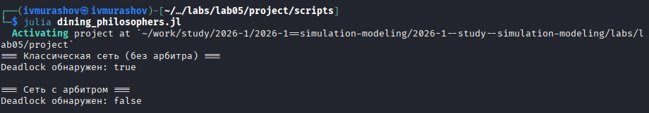
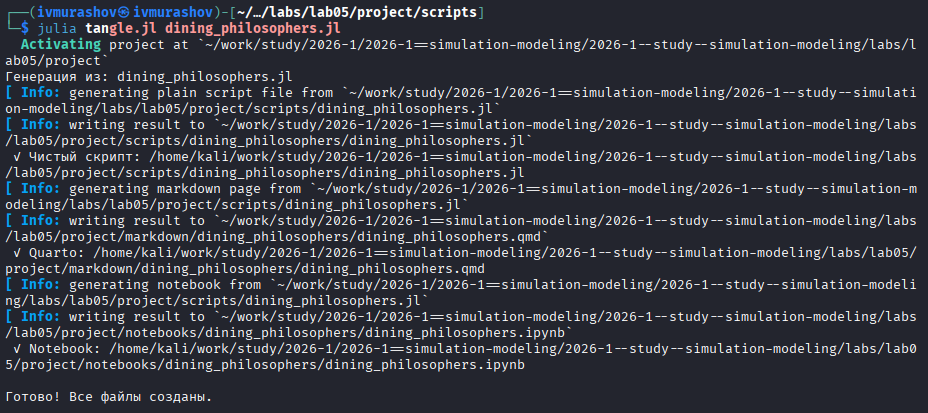
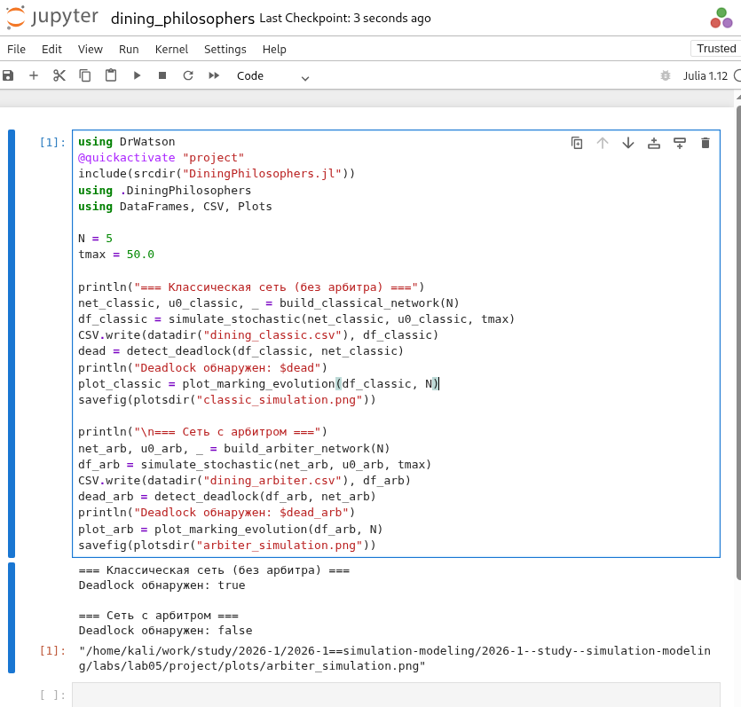
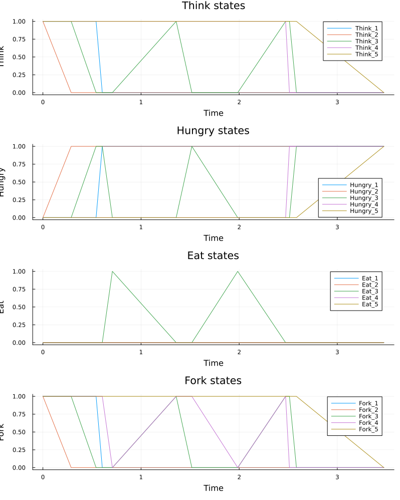
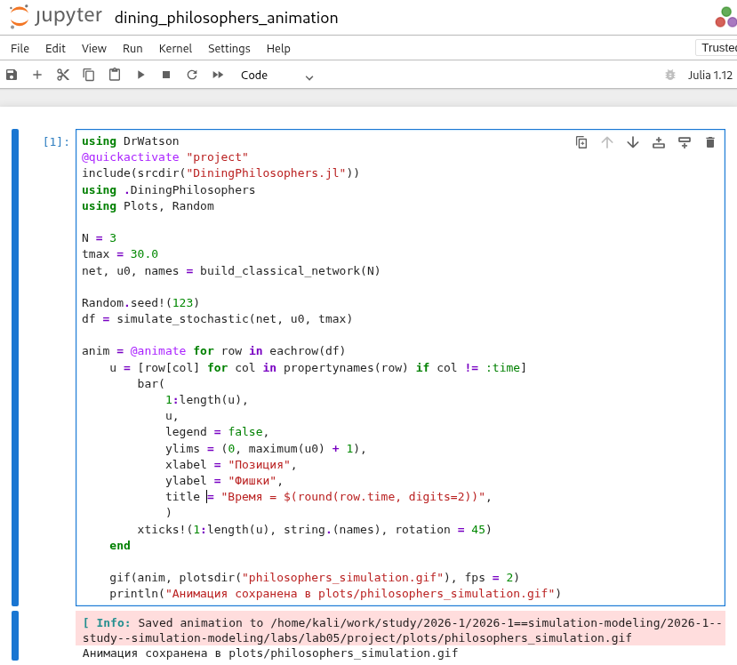

---
## Author
author:
  name: Мурашов Иван Вячеславович
  email: 1132236018@rudn.ru
  affiliation:
    - name: Российский университет дружбы народов
      country: Российская Федерация
      postal-code: 117198
      city: Москва
      address: ул. Миклухо-Маклая, д. 6

## Title
title: "Отчёт по лабораторной работе №5"
subtitle: "Имитационное моделирование"
license: "CC BY"
---

# Теоретическое введение

## 1. Сети Петри

Сеть Петри — это математический аппарат для моделирования дискретных систем, особенно параллельных, асинхронных и распределённых. Графически сеть Петри представляется как двудольный ориентированный граф двух типов вершин:

- **Позиции (places)** — пассивные элементы, обозначаемые кружками. Они описывают состояние системы (например, наличие ресурса). Внутри позиции могут находиться **фишки (tokens)** — неотрицательные целые числа, указывающие количество ресурсов.
- **Переходы (transitions)** — активные элементы, обозначаемые прямоугольниками. Они моделируют события или действия, которые могут произойти.
- **Дуги (arcs)** — направленные соединения между позициями и переходами. Входные дуги указывают, сколько фишек необходимо для срабатывания перехода; выходные — сколько фишек появится после срабатывания.

### Правило срабатывания перехода

Переход разрешён, если каждая его входная позиция содержит не менее фишек, чем кратность входной дуги. При срабатывании из входных позиций удаляется указанное количество фишек, а в выходные — добавляется.

### Формальное определение

Сеть Петри — это четвёрка \( N = (P, T, F, M_0) \), где:
- \( P \) — конечное множество позиций;
- \( T \) — конечное множество переходов;
- \( F \subseteq (P \times T) \cup (T \times P) \) — множество дуг;
- \( M_0: P \to \{N} \) — начальная маркировка.

### Основные свойства

- **Ограниченность** — количество фишек в позиции не превышает заданного предела.
- **Активность** — для любого перехода существует достижимая маркировка, в которой он может сработать (отсутствие вечных блокировок).
- **Достижимость** — возможность из начальной маркировки попасть в желаемую.
- **Сохраняемость** — взвешенная сумма фишек постоянна.

### Расширения

Временные, стохастические, раскрашенные и иерархические сети Петри.

## 2. Задача «Обедающие философы»

Сформулирована Эдгером Дейкстрой в 1965 году для иллюстрации проблем синхронизации в параллельных системах.

### Классическая постановка

За круглым столом сидят \( N \) философов (обычно 5). Перед каждым — тарелка с едой, между соседями лежит одна вилка (всего \( N \) вилок). Каждый философ может:
- думать,
- голодать (хочет есть),
- есть.

Чтобы поесть, философу нужны обе вилки — левая и правая. Если вилки заняты, он ждёт. Поев, философ кладёт вилки обратно.

### Проблема взаимной блокировки (deadlock)

Если все философы одновременно возьмут левую вилку, каждый будет ждать правую, занятую соседом. В результате никто не может есть — система замирает.

### Решение (арбитр)

Вводится дополнительный процесс (официант), который разрешает есть не более чем \( N-1 \) философам одновременно. Это предотвращает deadlock.

## 3. Моделирование на сетях Петри

Каждый философ и каждая вилка представляются позициями, переходы соответствуют действиям: «взять левую вилку», «взять правую вилку», «начать есть», «положить вилки». Сеть Петри наглядно показывает возникновение deadlock и позволяет экспериментировать с механизмами синхронизации (например, арбитром).

### Методы анализа

- **Детерминированное моделирование (ODE)** — описывает непрерывную динамику.
- **Стохастическое моделирование (алгоритм Гиллеспи)** — учитывает случайность времени срабатывания переходов.
- **Обнаружение deadlock** — проверка, есть ли в последней маркировке хотя бы один разрешённый переход.
- **Визуализация и анимация** — помогают наблюдать эволюцию маркировки во времени.

# Задание

- Создать рабочий каталог для всего курса.
- Создать рабочее пространство для программ в рамках лабораторной работы.
- Выполнить все задания по тексту лабораторной работы.
- Установить необходимые пакеты.
- Выполнить предложенный код.
- Преобразовать код в литературный стиль.
- Сгенерировать из литературного кода:
	- чистый код;
	- jupyter notebook;
	- документацию в формате Quarto.
	- Выполнить код из jupyter notebook.
- Интегрировать документацию в формате Quarto в отчёт.
- Добавить в код в литературном стиле вычисление для набора параметров.
- Сгенерировать из литературного кода с параметрами:
	- чистый код;
	- jupyter notebook;
	- документацию в формате Quarto.
- Выполнить код из jupyter notebook с параметрами.
- Интегрировать документацию с параметрами в формате Quarto в отчёт.

# Цель работы

Цели данной лабораторной работы:

- Построить сеть Петри для пяти философов, моделируя захват и освобождение вилок.
- Обнаружить состояние взаимной блокировки (deadlock), когда каждый философ взял одну вилку и ждёт вторую.
- Провести имитационное моделирование (стохастическое и детерминированное) и выявить наличие deadlock.
- Модифицировать сеть, чтобы предотвратить deadlock.
- Проанализировать результаты и оформить отчёт с графиками и анимацией.

# Выполнение лабораторной работы

Предварительно проверим правильность структуры нашего проекта ([рис. @fig-001]).

{#fig-001 width=70%}

## Код модели

Создадим файл src/DiningPhilosophers.jl с описанием базовой модели сети Петри ([рис. @fig-002]).

{#fig-002 width=70%}

## Базовые эксперименты

Создадим файл scripts/dining_philosophers.jl. Скрипт выполняет основное моделирование и сравнение двух вариантов сети Петри: классическую модель (без арбитра), в которой возможна взаимная блокировка (deadlock) и модифицированную модель с арбитром, которая должна предотвращать deadlock ([рис. @fig-003]).

{#fig-003 width=70%}



Запустим скрипт ([рис. @fig-004]).

{#fig-004 width=70%}

Создадим производные форматы с помощью скрипта tangle.jl ([рис. @fig-005]).

{#fig-005 width=70%}

Запустим файл ipynb в jupyter-notebook ([рис. @fig-006]).

{#fig-006 width=70%}

Просмотрим результирующие графики.

{ width=70%}

{ width=70%}

## Анимация процесса

Создадим файл scripts/dining_philosophers_animation.jl. Анимация позволяет увидеть, как меняется маркировка (фишки) в каждой позиции, и особенно наглядно показывает возникновение deadlock в классической модели ([рис. @fig-007]).

{#fig-007 width=70%}

 

Запустим скрипт ([рис. @fig-008]).

{#fig-008 width=70%}

Создадим производные форматы с помощью скрипта tangle.jl ([рис. @fig-009]).

{#fig-009 width=70%}

Запустим файл ipynb в jupyter-notebook ([рис. @fig-010]).

{#fig-010 width=70%}

Просмотрим результирующий gif-файл.

## Итоговый отчёт

Создадим файл scripts/dining_philosophers_report.jl. Он нужен для сравнительного анализа двух моделей (с арбитром и без) по одному ключевому показателю — числу философов, находящихся в состоянии «Ест» (Eat_i). Скрипт генерирует сводный график ([рис. @fig-011]).

{#fig-011 width=70%}



Запустим скрипт ([рис. @fig-012]).

{#fig-012 width=70%}

Создадим производные форматы с помощью скрипта tangle.jl ([рис. @fig-013]).

{#fig-013 width=70%}

Запустим файл ipynb в jupyter-notebook ([рис. @fig-014]).

{#fig-014 width=70%}

Просмотрим результирующие графики.

{ width=70%}

# Выводы

В ходе данной лабораторной работы мной были построены классическая и модифицированная сети Петри для задачи "Обедающие философы", проведено стохастическое и детерминированное имитационное моделирование, обнаружен deadlock в классической сети и продемонстрировано его предотвращение с помощью арбитра, а также выполнен анализ результатов с визуализацией в виде графиков и анимации.
