---
## Author
author:
  name: Мурашов Иван Вячеславович
  email: 1132236018@rudn.ru
  affiliation:
    - name: Российский университет дружбы народов
      country: Российская Федерация
      postal-code: 117198
      city: Москва
      address: ул. Миклухо-Маклая, д. 6

## Title
title: "Отчёт по лабораторной работе №6"
subtitle: "Имитационное моделирование"
license: "CC BY"
---

# Задание

- Создать рабочий каталог для всего курса.
- Создать рабочее пространство для программ в рамках лабораторной работы.
- Выполнить все задания по тексту лабораторной работы.
- Установить необходимые пакеты.
- Выполнить предложенный код.
- Преобразовать код в литературный стиль.
- Сгенерировать из литературного кода:
	- чистый код;
	- jupyter notebook;
	- документацию в формате Quarto.
	- Выполнить код из jupyter notebook.
- Интегрировать документацию в формате Quarto в отчёт.
- Добавить в код в литературном стиле вычисление для набора параметров.
- Сгенерировать из литературного кода с параметрами:
	- чистый код;
	- jupyter notebook;
	- документацию в формате Quarto.
- Выполнить код из jupyter notebook с параметрами.
- Интегрировать документацию с параметрами в формате Quarto в отчёт.

# Цель работы

Целью данной лабораторной работы является реализация модели эпидемии SIR с использованием сетей Петри и анализ результата действия данной модели.

# Выполнение лабораторной работы

Предварительно проверим правильность структуры нашего проекта ([рис. @fig-001]).

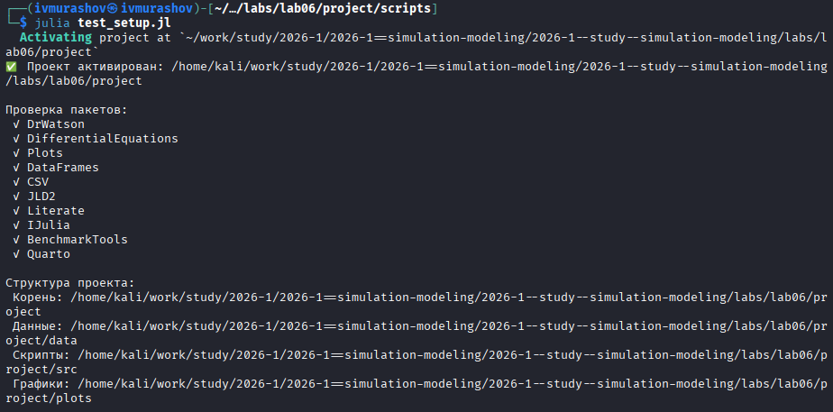{#fig-001 width=70%}

## Код модели

Создадим файл src/SIRPetri.jl с реализацией вычислительной логики модели ([рис. @fig-002]).

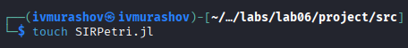{#fig-002 width=70%}

## Базовый прогон модели

Создадим файл scripts/sirpetri_run.jl. Скрипт выполняет один базовый эксперимент с фиксированными параметрами β = 0.3, γ = 0.1 и запускает два типа симуляции: детерминированную (решение ОДУ) — даёт плавную усреднённую динамику и стохастическую (алгоритм Гиллеспи) — учитывает случайные флуктуации ([рис. @fig-003]).

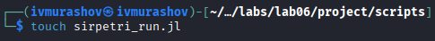{#fig-003 width=70%}



Запустим скрипт ([рис. @fig-004]).

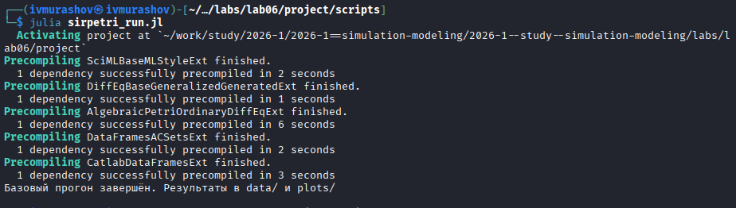{#fig-004 width=70%}

Создадим производные форматы с помощью скрипта tangle.jl ([рис. @fig-005]).

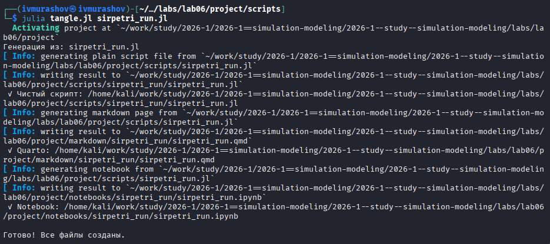{#fig-005 width=70%}

Запустим файл ipynb в jupyter-notebook ([рис. @fig-006]).

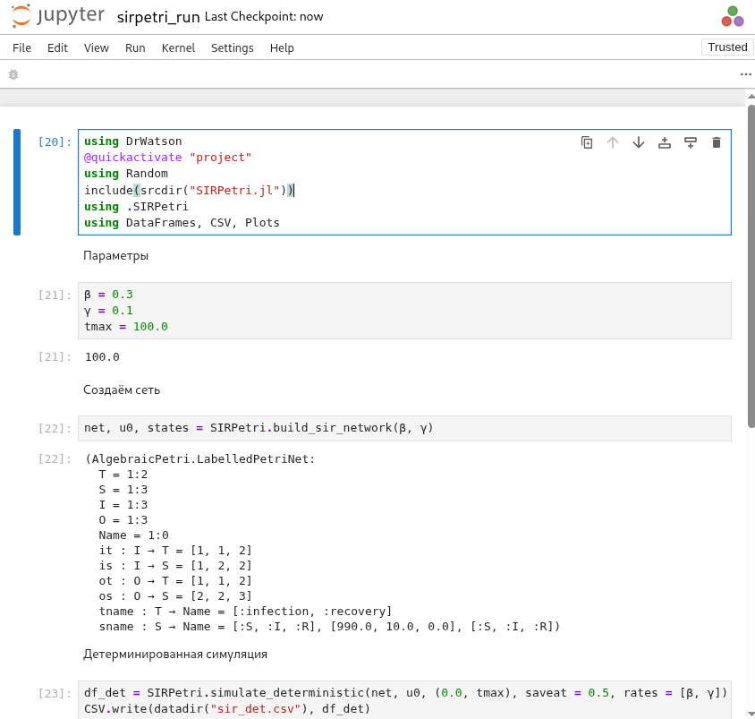{#fig-006 width=70%}

Просмотрим результирующие графики.

{ width=70%}

{ width=70%}

Детерминированный график показывает классический пик эпидемии: рост I, максимум, затем спад до нуля; R растёт и выходит на плато, S падает.
Стохастический график может иметь шумы и, возможно, немного отличаться по времени пика и амплитуде – это демонстрирует влияние случайности.
Сравнение двух типов симуляции показывает, что при большом начальном числе восприимчивых (990) стохастическая траектория близка к детерминированной, но при малых числах различия были бы значительны.

## Коэффициент заражения β

Создадим файл scripts/sirpetri_scan_parameters.jl. Скрипт исследует чувствительность модели к изменению параметра β (скорости заражения). Для каждого значения β из диапазона 0.1:0.05:0.8 запускается детерминированная симуляция (γ = 0.1 фиксирован). Для каждого прогона вычисляются: максимальное число инфицированных (пик эпидемии) – peak_I и конечное число выздоровевших – final_R ([рис. @fig-007]).

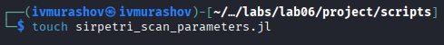{#fig-007 width=70%}

 

Запустим скрипт ([рис. @fig-008]).

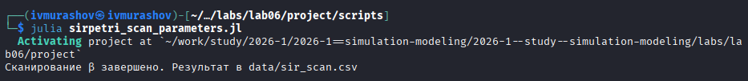{#fig-008 width=70%}

Создадим производные форматы с помощью скрипта tangle.jl ([рис. @fig-009]).

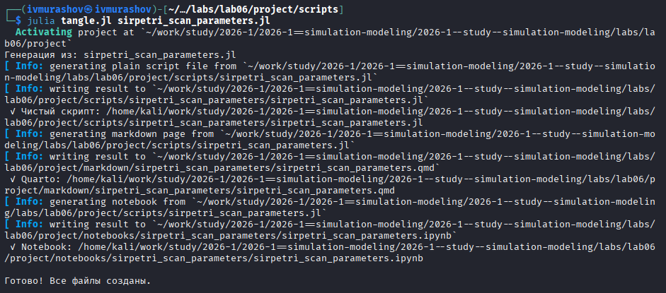{#fig-009 width=70%}

Запустим файл ipynb в jupyter-notebook ([рис. @fig-010]).

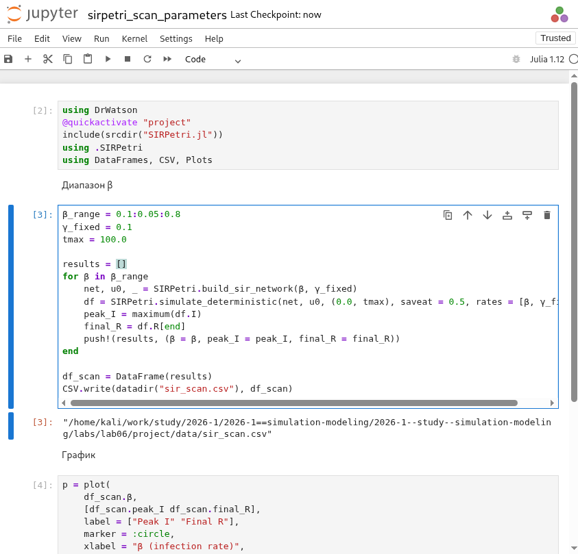{#fig-010 width=70%}

Просмотрим результирующие графики.

{ width=70%}

При малых β (например, 0.1) эпидемия не возникает (peak_I ≈ 0, final_R ≈ 0).
С ростом β пик заболеваемости сначала резко растёт, затем достигает насыщения (почти всё население переболевает).
Конечное R(β) также растёт с β, но медленнее; при больших β практически всё население переходит в R.
Такой график демонстрирует пороговое явление, характерное для модели SIR: существует критическое значение β, выше которого возникает вспышка.

## Анимация детерминированной динамики

Создадим файл scripts/sirpetri_animate.jl. Скрипт создаёт GIF-анимацию, показывающую, как со временем меняется количество людей в каждой из трёх групп (S,I,R). Анимация позволяет наглядно увидеть распространение эпидемии, пик и спад ([рис. @fig-011]).

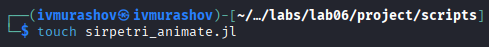{#fig-011 width=70%}



Запустим скрипт ([рис. @fig-012]).

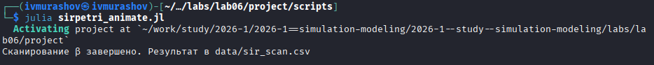{#fig-012 width=70%}

Создадим производные форматы с помощью скрипта tangle.jl ([рис. @fig-013]).

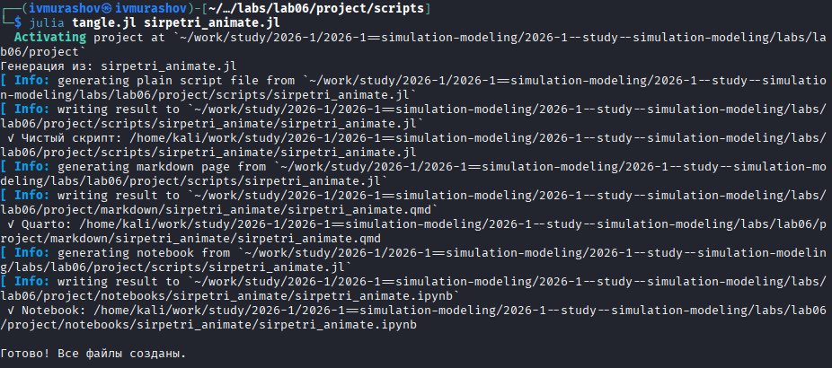{#fig-013 width=70%}

Запустим файл ipynb в jupyter-notebook ([рис. @fig-014]).

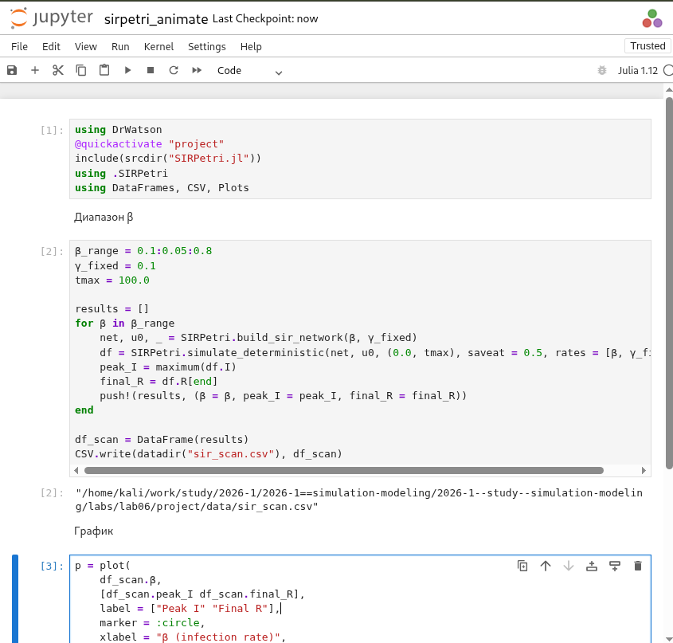{#fig-014 width=70%}

Просмотрим результирующий gif-файл.

На первых кадрах I растёт, S падает.
В момент пика I достигает максимума, затем снижается, а R растёт.
Анимация даёт динамическое представление о том, как волна инфекции проходит через популяцию.

## Итоговый отчёт

Создадим файл scripts/sirpetri_report.jl. Скрипт загружает ранее сохранённые результаты (sir_det.csv, sir_stoch.csv, sir_scan.csv) и строит сравнительные графики для итогового отчёта ([рис. @fig-015]).

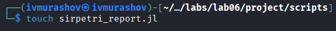{#fig-015 width=70%}



Запустим скрипт ([рис. @fig-016]).

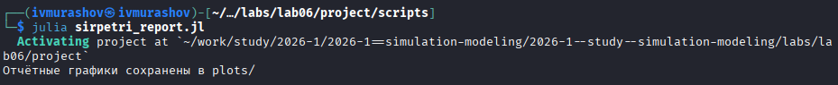{#fig-016 width=70%}

Создадим производные форматы с помощью скрипта tangle.jl ([рис. @fig-017]).

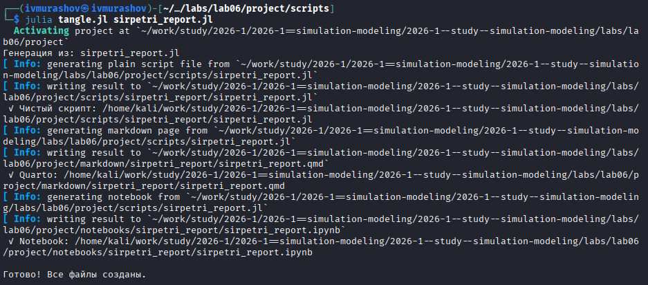{#fig-017 width=70%}

Запустим файл ipynb в jupyter-notebook ([рис. @fig-018]).

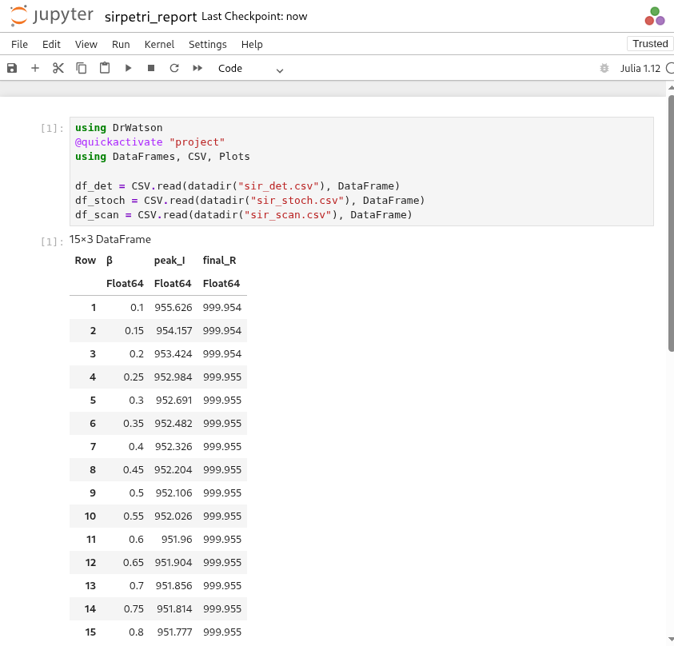{#fig-018 width=70%}

Просмотрим результирующие графики.

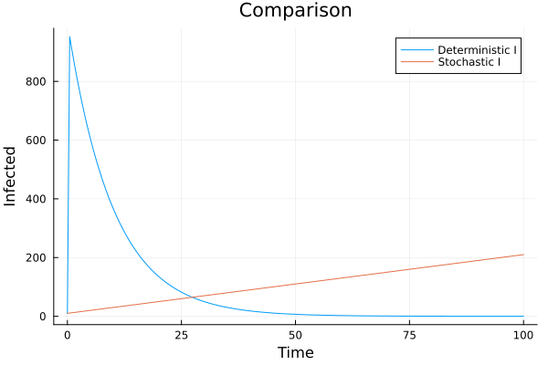{ width=70%}

{ width=70%}

# Выводы

В ходе данной лабораторной работы мной была реализована модель эпидемии SIR с использованием сетей Петри и проанализирован результат действия данной модели.
