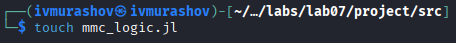
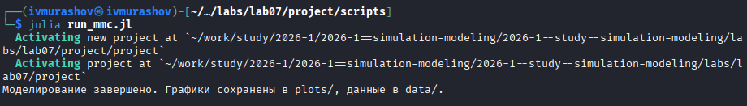
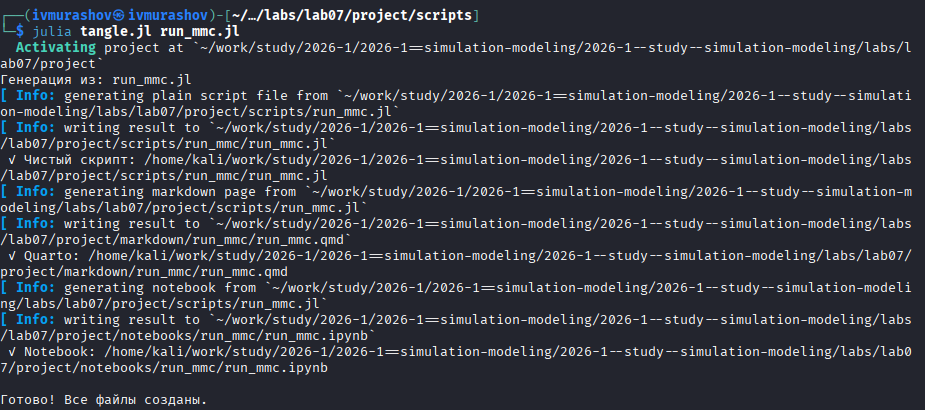
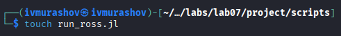
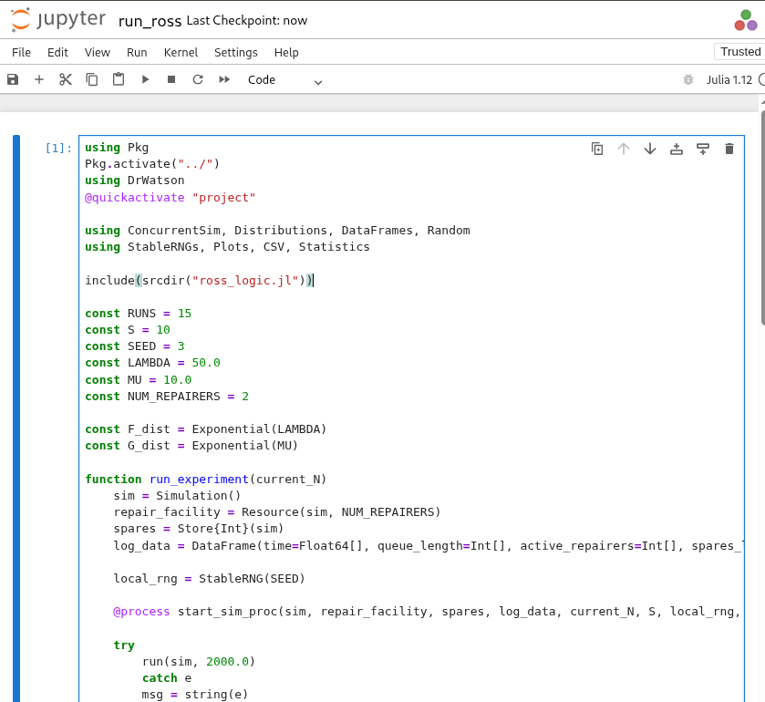

---
## Author
author:
  name: Мурашов Иван Вячеславович
  email: 1132236018@rudn.ru
  affiliation:
    - name: Российский университет дружбы народов
      country: Российская Федерация
      postal-code: 117198
      city: Москва
      address: ул. Миклухо-Маклая, д. 6

## Title
title: "Отчёт по лабораторной работе №7"
subtitle: "Имитационное моделирование"
license: "CC BY"
---

# Задание

- Создать рабочий каталог для всего курса.
- Создать рабочее пространство для программ в рамках лабораторной работы.
- Выполнить все задания по тексту лабораторной работы.
- Установить необходимые пакеты.
- Выполнить предложенный код.
- Преобразовать код в литературный стиль.
- Сгенерировать из литературного кода:
	- чистый код;
	- jupyter notebook;
	- документацию в формате Quarto.
	- Выполнить код из jupyter notebook.
- Интегрировать документацию в формате Quarto в отчёт.
- Добавить в код в литературном стиле вычисление для набора параметров.
- Сгенерировать из литературного кода с параметрами:
	- чистый код;
	- jupyter notebook;
	- документацию в формате Quarto.
- Выполнить код из jupyter notebook с параметрами.
- Интегрировать документацию с параметрами в формате Quarto в отчёт.

# Цель работы

Целью данной лабораторной работы является реализация имитационной модели Росса (задачи о ремонте оборудования) с использованием дискретно-событийного моделирования и анализ показателей надежности системы при различных нагрузках.

# Теоретическое введение

## Описание модели
В данной работе рассматривается классическая задача о ремонте оборудования (Machine Repair Problem). Система состоит из трех основных компонентов:

1.  **Основные машины ($N$):** Постоянно работающее количество агрегатов. Каждая машина имеет случайное время наработки на отказ, распределенное по экспоненциальному закону с параметром $\lambda$.
2.  **Запасные машины ($S$):** Резервный фонд. Когда основная машина выходит из строя, она немедленно заменяется исправной из запаса (если таковая имеется).
3.  **Ремонтная база ($M$):** Группа ремонтников или каналов обслуживания. Время ремонта распределено экспоненциально с параметром $\mu$.

## Математическая постановка
Система считается работоспособной, пока в эксплуатации находятся все $N$ машин. Если запас исчерпан ($S=0$) и происходит очередная поломка, количество работающих машин становится меньше $N$, что интерпретируется как **отказ системы**.

### Ключевые показатели:
* **Интенсивность отказов одной машины:** $\lambda = 1 / \text{MTTF}$ (Mean Time To Failure).
* **Интенсивность восстановления:** $\mu = 1 / \text{MTTR}$ (Mean Time To Repair).
* **Коэффициент загрузки:** $\rho = \mu / (N \cdot \lambda)$, определяющий стабильность системы.

## Цели моделирования
Имитационное моделирование позволяет исследовать:
* **Среднее время до первого отказа системы (краха)**, когда на складе не остается запасных частей для замены.
* **Динамику уровня запаса** на складе.
* **Загрузку ремонтной базы** и длину очереди на восстановление.

Аналитическое решение для среднего времени до краха системы ($E[T]$) при одном ремонтнике описывается формулой:

$$ E[T] = \frac{1}{N\lambda} \sum_{k=0}^{S} \left(\frac{\mu}{N\lambda}\right)^k $$

# Выполнение лабораторной работы

Предварительно проверим правильность структуры нашего проекта ([рис. @fig-001]).

{#fig-001 width=70%}

## Модель M/M/c

Создадим файл src/mmc_logic.jl с реализацией вычислительной логики модели ([рис. @fig-002]).

{#fig-002 width=70%}

Создадим файл scripts/run_mmc.jl. Скрипт реализует дискретно-событийную модель для анализа надёжности системы, учитывающую стохастический характер поломок и задержки в очереди на ремонт. В отличие от усреднённых расчётов, имитация фиксирует случайные флуктуации запаса и позволяет эмпирически определить среднее время до краха системы при различных нагрузках $N$ ([рис. @fig-004]).

{#fig-004 width=70%}



Запустим скрипт ([рис. @fig-005]).

{#fig-005 width=70%}

Создадим производные форматы с помощью скрипта tangle.jl ([рис. @fig-006]).

{#fig-006 width=70%}

Запустим файл ipynb в jupyter-notebook ([рис. @fig-007]).

{#fig-007 width=70%}

## Модель Росса

Создадим файл src/ross_logic.jl с реализацией вычислительной логики модели ([рис. @fig-008]).

{#fig-008 width=70%}

Создадим файл scripts/run_ross.jl. В нём описывается логика модели Росса, где процесс работы каждой машины представлен как последовательность состояний «эксплуатация — ожидание замены — ремонт». Модель имитирует конкуренцию за ограниченный ресурс ремонтной базы и позволяет отследить мгновенное изменение уровня резервного фонда $S$ при возникновении случайных отказов ([рис. @fig-009]).

{#fig-010 width=70%}



Запустим скрипт ([рис. @fig-011]).

{#fig-011 width=70%}

Создадим производные форматы с помощью скрипта tangle.jl ([рис. @fig-006]).

{#fig-012 width=70%}

Запустим файл ipynb в jupyter-notebook ([рис. @fig-013]).

{#fig-013 width=70%}

# Выводы

В ходе выполнения данной лабораторной работы мной была реализована имитационная модель Росса с использованием дискретно-событийного моделирования и анализ показателей надежности системы при различных нагрузках.
