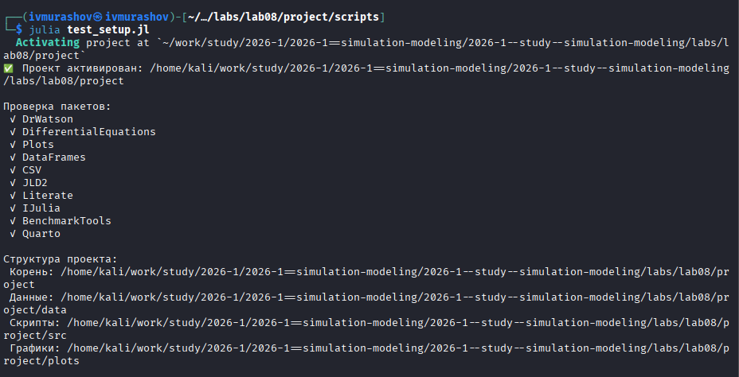
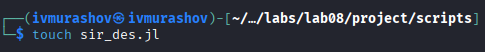
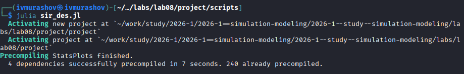
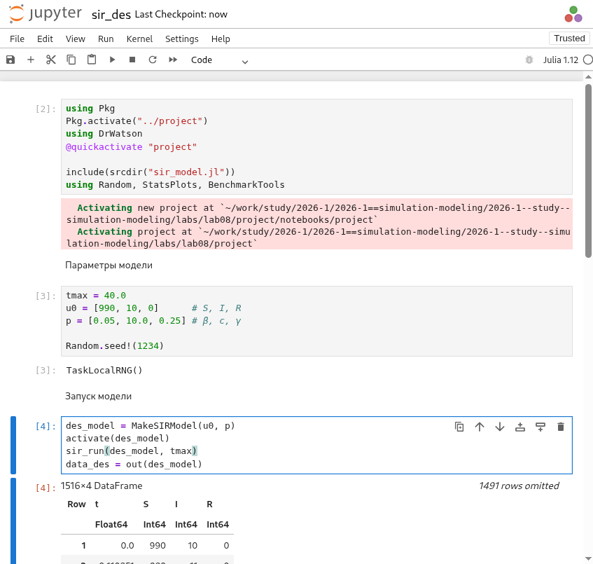
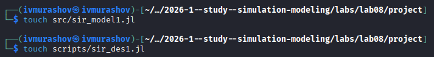

---
## Author
author:
  name: Мурашов Иван Вячеславович
  email: 1132236018@rudn.ru
  affiliation:
    - name: Российский университет дружбы народов
      country: Российская Федерация
      postal-code: 117198
      city: Москва
      address: ул. Миклухо-Маклая, д. 6
## Title
title: Лабораторная работа №8
subtitle: Имитационное моделирование
license: CC BY
date: 2026-05-28
date-format: "YYYY-MM-DD"
---

## Цель работы

Целью данной лабораторной работы является изучить дискретно-событийный подход к имитационному моделированию на примере классической модели распространения инфекции SIR. Реализовать стохастическую дискретно-событийную модель в виде программного комплекса на языке Julia. Провести анализ влияния параметров, сравнить со стохастической и детерминированной версиями, оценить производительность и модифицировать модель.

## Выполнение лабораторной работы

Предварительно проверим правильность структуры нашего проекта ([рис. @fig-001]).

{#fig-001 width=70%}

## Работа с изначальным кодом

Создадим файл src/sir_model.jl с реализацией вычислительной логики модели ([рис. @fig-002]).

{#fig-002 width=70%}

## Работа с изначальным кодом

Создадим файл scripts/sir_des.jl. Скрипт запуска - он задаёт параметры, инициализирует модель, выполненяет прогон и визуализацию ([рис. @fig-003]).

{#fig-003 width=70%}

## Работа с изначальным кодом

Запустим скрипт ([рис. @fig-004]).

{#fig-004 width=70%}

## Работа с изначальным кодом

Создадим производные форматы с помощью скрипта tangle.jl ([рис. @fig-005]).

{#fig-005 width=70%}

## Работа с изначальным кодом

Запустим файл ipynb в jupyter-notebook ([рис. @fig-006]).

{#fig-006 width=70%}

## Работа с изначальным кодом

Просмотрим результирующий график ([рис. @fig-007]).

{#fig-007 width=70%}

## Внесение изменений

Создаём файлы модели и скрипт запуска ([рис. @fig-008]).

{#fig-008 width=70%}

## Внесение изменений

Запустим скрипт ([рис. @fig-009]).

{#fig-009 width=70%}

## Внесение изменений

Создадим производные форматы с помощью скрипта tangle.jl ([рис. @fig-010]).

{#fig-010 width=70%}

## Внесение изменений

Запустим файл ipynb в jupyter-notebook ([рис. @fig-011]).

{#fig-011 width=70%}

## Внесение изменений

Просмотрим результирующие графики ([рис. @fig-012], [рис. @fig-013], [рис. @fig-014]).

{#fig-012 width=70%}

## Внесение изменений

{#fig-013 width=70%}

## Внесение изменений

{#fig-014 width=70%}

## Выводы

В ходе выполнения данной лабораторной работы мной был изучен дискретно-событийный подход к имитационному моделированию на примере классической модели распространения инфекции SIR. Реализована стохастическую дискретно-событийную модель в виде программного комплекса на языке Julia и проведён анализ влияния параметров, сравнение со стохастической и детерминированной версиями, так же проведена оценка производительности и модифицирована модель.
